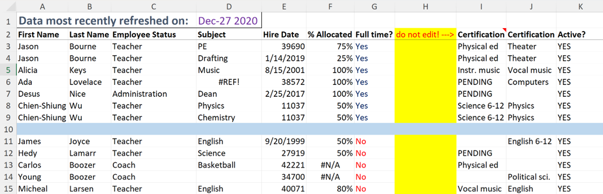
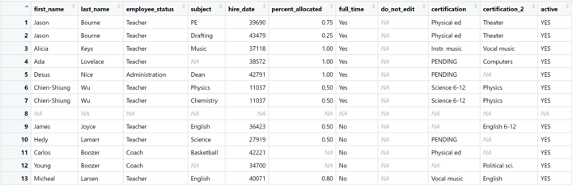
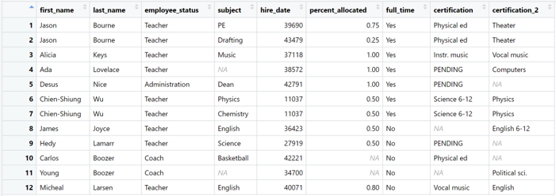
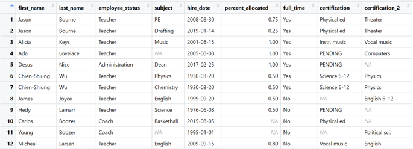
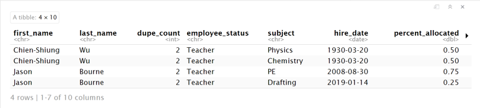
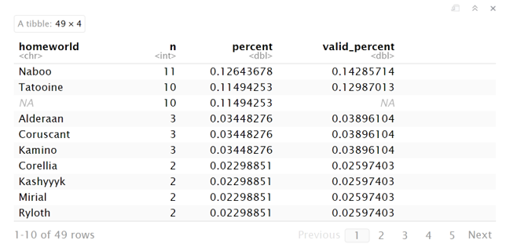
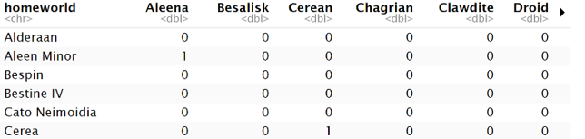
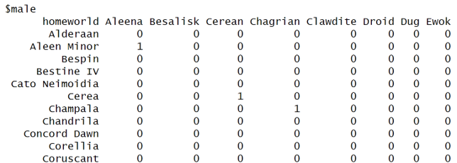

```{r setup, include=FALSE}

library(tidyverse)
library(modelsummary)
library(kableExtra)
library(janitor)
library(readxl)
library(here)
```


# Hidden Talents, Huge Impact

## The Example of Will Hunting

- Data cleaning & preparation is tedious…but it is also essential
- The Metaphor of Matt Damon as ‘Will Hunting’
- janitor operating in the background, ensuring that data is in the best possible shape for analysis
- Numbers Around Us: [“Why Every Data Scientist Needs The janitor Package”](https://www.r-bloggers.com/2024/08/why-every-data-scientist-needs-the-janitor-package/#:~:text=Without%20proper%20data%20cleaning%2C%20even,and%20visible%20work%20to%20shine.)

{width=50%, height=50%}

# Never Underestimate The Janitor

<div class="columns">

<div class="column" style="width: 45%;">

### Cleaning Dirty Data

- `clean_names()`
- `remove_empty()` & `remove_constant()`
- `excel_numeric_to_date()`

</div>

<div class="column" style="width: 45%;">

### Exploring Dirty Data

- `det_dupes()`
- `tabyl()`
- `adorn_()`

</div>

</div>

---


# Cleaning With Janitor - Messy Teacher Roster
{width=50%, height=50%}


# Cleaning With Janitor - Import to R
{width=50%, height=50%}


# Function: clean_names()

Use the clean_names() function
```{r, eval=FALSE}
cleaner <- here('dirty_data.xlsx') |> 
  read_excel(skip = 1, .name_repair = "minimal") |> 
  clean_names()

```
{width=25%, height=25%}


# Function: remove_empty() & remove_constant()
Use the remove_empty() & remove_constant() functions:
```{r, eval=FALSE}
cleaner <- here('dirty_data.xlsx') |> 
  read_excel(skip = 1, .name_repair = "minimal") |> 
  clean_names() |> 
  remove_empty() |> 
  remove_constant()
```
{width=25%, height=25%}


# Function: excel_numeric_to_date()
Use the excel_numeric_to_date() function:
```{r, eval=FALSE}
cleaner <- here('dirty_data.xlsx') |> 
  read_excel(skip = 1, .name_repair = "minimal") |> 
  clean_names() |> 
  remove_empty() |> 
  remove_constant() |> 
  mutate(hire_date = excel_numeric_to_date(hire_date))
```
{width=25%, height=25%}


# Function: get_dupes()
Use the get_dupes() function to inspect for duplicates:
```{r, eval=FALSE}
cleaner |> 
  get_dupes(contains("name"))
```
\

- Can see that two of our teachers are repeated
- Especially useful when working on large data frames!

{width=25%, height=25%}


# Function: get_dupes() Star Wars!
For the Star Wars data frame, use the get_dupes() function to tally number of duplicates for multiple variables:
```{r, eval=FALSE}
starwars |> 
  get_dupes(homeworld, species, eye_color, hair_color, sex)
```
\
- Based on the conditions for homeworld, species, eye color, hair color, and sex we can see all the matches in the data frame
- Helpful janitor function for exploring data!

{width=25%, height=25%}


# Janitor's tabyl Function & Data Analysis
- tabyl provides a quick summary table for a data frame; It's great for counting and summarizing categorical variables
- The Base R equivalent, Count, only works with data frames; tabyl works on vectors too when tabulating a single variable
  - tabyl(groceries$fruit)
- Using tabyl on a data frame, can perform 1-way, 2-way, and 3-way counts of the data


# Function: tabyl() One-Way
For the Star Wars data frame, use the tabyl() function to perform a one-way test:
```{r, eval=FALSE}
starwars |> 
  tabyl(homeworld) |> 
  as_tibble() |> 
  arrange(desc(n))
```
{width=25%, height=25%}


# Function: tabyl() Two & Three-Ways
Now perform a two-way test:
```{r, eval=FALSE}
starwars |> 
  tabyl(homeworld, species) |> 
  as_tibble()
```
{width=25%, height=25%}

…and a three-way test:
```{r, eval=FALSE}
starwars |> 
  tabyl(homeworld, species, sex)
```
{width=25%, height=25%}

# tabyl & adorn_ Functions
- After generating a table with tabyl, you can further format it using the adorn_ set of functions
- Some of the adorn_ functions include:
  - adorn_totals – Adds totals to a table, either row-wise, column-wise, or both.
  - adorn_percentages – Converts counts in a tabyl() output into proportions (percentages).
  - adorn_pct_formatting – Formats the percentages from decimals to percentage.
  - adorn_title – Adds a title to the tabyl (e.g., "Total", "Percent").


# Function: tabyl() & adorn_
Use the tabyl() function in combination with adorn_ and kable():
```{r, eval=TRUE}
starwars |> 
  tabyl(species) |> 
  adorn_totals() |> 
  adorn_pct_formatting() |> 
  knitr::kable()
```


# In Conclusion
- **janitor** is a user-friendly and powerful tool for examining and cleaning dirty data; it’s a multipurpose tool for data analysis that streamlines the data cleaning work, the foundation of every data analysis project.
- **tabyl** excels in automatically computing proportions and producing tidy data frames that integrate seamlessly with the tidyverse ecosystem; the **adorn_** functions can further enhance tabyl usefulness when generating informative frequency tables.
- The janitor package has many other useful functions for data cleaning and exploration; those functions can be found here - https://sfirke.github.io/janitor/index.html 


# "Your move, chief."

{width=100%, height=100%}


# Sources Cited
- “Janitor Package - RDocumentation.” Accessed October 23, 2024. https://www.rdocumentation.org/packages/janitor/versions/2.2.0.
- Sant, Gus Van. “Good Will Hunting - Apple TV (HU).” Apple TV, January 9, 1998. https://tv.apple.com/hu/movie/good-will-hunting/umc.cmc.ljmzio5szpnhca4ydns8f99q.
- “Sfirke/Janitor: Simple Tools for Data Cleaning in R.” Accessed October 23, 2024. https://github.com/sfirke/janitor.
- “Why Every Data Scientist Needs the Janitor Package.” Numbers around Us (blog), August 16, 2024. https://medium.com/number-around-us/why-every-data-scientist-needs-the-janitor-package-da37e4dcfe24.
