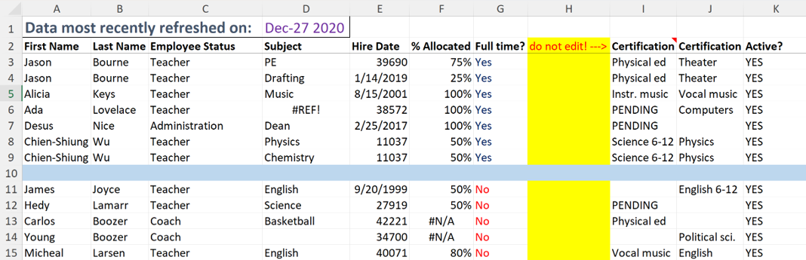
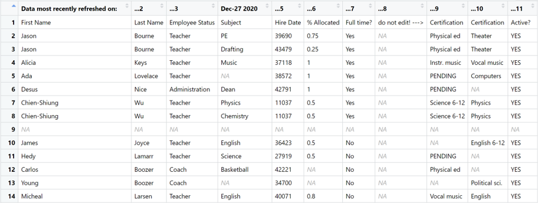
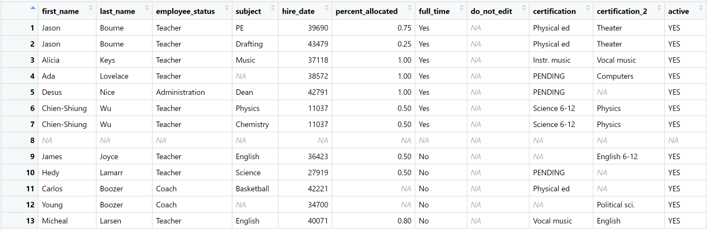
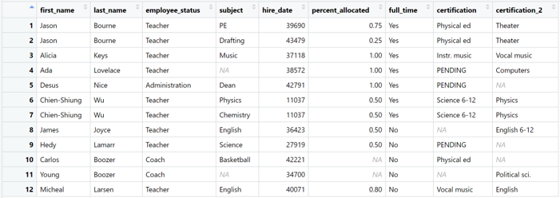
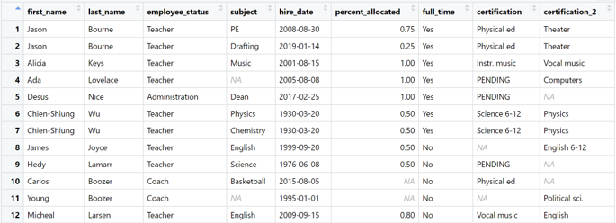
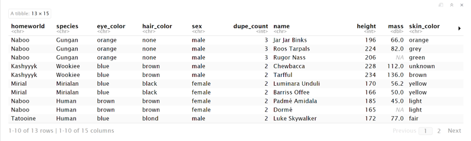
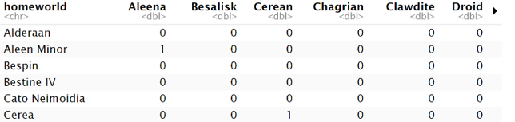
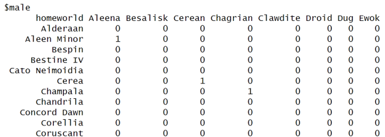
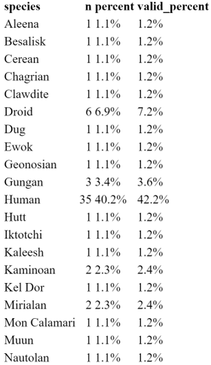
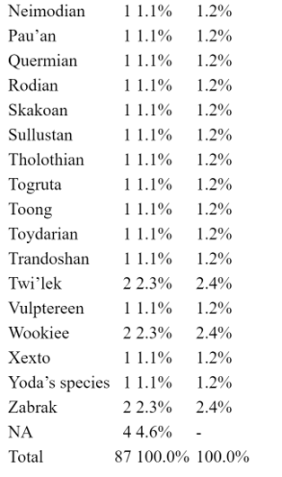

```{r setup, include=FALSE}
options(htmltools.dir.version = FALSE)


library(tidyverse)
library(modelsummary)
library(kableExtra)
library(janitor)
library(readxl)
library(here)
```

# Hidden Talents, Huge Impact
## The Metaphor of Good Will Hunting
.pull-left[

]

.pull-right[
- Data cleaning & preparation is tedious…but it is also essential
- The Metaphor of Matt Damon as ‘Will Hunting’
- janitor operating in the background, ensuring that data is in the best possible shape for analysis
- Numbers Around Us: [“Why Every Data Scientist Needs The janitor Package”](https://www.r-bloggers.com/2024/08/why-every-data-scientist-needs-the-janitor-package/#:~:text=Without%20proper%20data%20cleaning%2C%20even,and%20visible%20work%20to%20shine.)
</div>

]

---

# Never Underestimate the Janitor
“I just have a little question here. You could be a janitor anywhere. Why did work at the most prestigious technical college in the whole **EXPLATIVE** world?” – Robin Williams as Dr. Sean Maguireto, “Good Will Hunting”

</div>

.pull-left[
**Cleaning Dirty Data**
- clean_names()
- remove_empty() & remove_constant()
- excel_numeric_to_date()
]

.pull-right[
**Exploring Dirty Data**
- get_dupes()
- tabyl()
- adorn_()
]

</div>

--

<div style="text-align: center;">
  
  <p>Example of a roster of teachers from a fictional American high school; available [here](https://github.com/sfirke/janitor)</p>
</div>

---
# Load Data Into R

<div style="text-align: center;">
  
  <p>Loading the data into R, there’s a lot of issues at the onset. **But janitor will expedite the cleanup!**
</p>
</div>

---
# Function: clean_names()

.pull-left[
The **clean_names()** function standardizes column names, making them consistent and easier to work with. It converts names to snake_case and removes special characters.
]

.pull-right[
Using the clean_names() function on our teacher roster:
```{r, eval=FALSE}
cleaner <- here('dirty_data.xlsx') |> 
  read_excel(skip = 1, .name_repair = "minimal") |> 
  clean_names()

```
]

--

- Capitalization ➡️ *lowercase typeface*
- Spacing ➡️ *replaced with _*
- Special Characters (i.e. %, /) ➡️ *replaced with word*




---
# Function: remove_empty() & remove_constant()

.pull-left[
The **remove_empty()** removes empty rows/columns from a data frame. Useful for cleaning up datasets with missing (NA) data.

Similarly, function **remove_constant()** removes rows/columns with a constant entry.
]

.pull-right[
Use the remove_empty() & remove_constant() functions:

```{r, eval=FALSE}
even_cleaner <- here('dirty_data.xlsx') |> 
  read_excel(skip = 1, .name_repair = "minimal") |> 
  clean_names() |> 
  remove_empty() |> 
  remove_constant()

```
]

--

Voilà, we've removed all empty rows and columns, and removed the ‘active’ column which only had values of ‘YES’





---

# Function: excel_numeric_to_date()

.pull-left[
The function **excel_numeric_to_date()** Converts numeric date formats used by Excel to actual R dates.

Lets use the this function to address the hire_date column:

```{r, eval=FALSE}
as_clean_as_it_gets <- here('dirty_data.xlsx') |> 
  read_excel(skip = 1, .name_repair = "minimal") |> 
  clean_names() |> 
  remove_empty() |> 
  remove_constant() |> 
  mutate(hire_date = excel_numeric_to_date(hire_date))

```
]

--



.pull-right[

]
---
# Function: Exploring Data w/ get_dupes()

.pull-left[
The function **get_dupes()** identifies duplicate rows in a data frame, showing them for easy inspection.

A very useful tool for exploring your data.
]

.pull-right[
For the Star Wars data frame, use the get_dupes() function to tally number of duplicates for multiple variables:

```{r, eval=FALSE}
starwars |> 
  get_dupes(homeworld, species, eye_color, hair_color, sex)
```
]

--

- Based on the conditions for homeworld, species, eye color, hair color, and sex we can see all the matches in the data frame
- Helpful Janitor function for exploring data!



---
# Janitor's Tabyl Function For Exploration
**As data scientists, a big part of the job is to tally observations. But the usual go-to functions, table() from base R and count from 'dplyr', have shortcomings:**
- table() doesn’t accept data.frame inputs and doesn't work well with pipping
- table() doesn't output data frames, and requires additional steps for formatting
- count() from 'dpyl' is limited for more complex tables and cross-tabulations

--

**tabyl() offers clear advantages over these functions:**

- tabyl provides a quick summary table for a data frame; It's great for counting and summarizing categorical variables and providing easy percent calculations
- count() from 'dplyr', only works with data frames; tabyl works on vectors too when tabulating a single variable
- Using tabyl on a data frame, can perform quick 1-way, 2-way, and 3-way counts of the data

---
# Function: tabyl()

.pull-left[
tabyl() creates frequency tables for a vector or a combination of variables in a data frame. It is useful for quickly summarizing categorical data and viewing counts and proportions.
]

.pull-right[
For the Star Wars data frame, use the tabyl() function to perform a one-way test:

```{r, eval=FALSE}
starwars |> 
  tabyl(homeworld) |> 
  as_tibble() |> 
  arrange(desc(n))
```
]

--


---
**Now lets perform a two-way test:**
```{r, eval=FALSE}
starwars |> 
  tabyl(homeworld, species)
```
--

---
**...and now a three-way test:**
```{r, eval=FALSE}
starwars |> 
  tabyl(homeworld, species, sex)
```
--

---
# tabyl & adorn_ functions
- After generating a table with tabyl, you can further format it using the adorn_ set of functions, formatting tabyl output into friendly and readable tables.

- Some of the adorn_ functions include:
  - adorn_totals – Adds totals to a table, either row-wise, column-wise, or both.
  - adorn_percentages – Converts counts in a tabyl() output into proportions (percentages).
  - adorn_pct_formatting – Formats the percentages from decimals to percentage.
  - adorn_title – Adds a title to the tabyl (e.g., "Total", "Percent").

---

.pull-left[
Lets use adorn functions to cleanup our output for the tabyl of species from the Star Wars dataframe.
```{r, eval=FALSE}
starwars |> 
  tabyl(species) |> 
  adorn_totals() |> 
  adorn_pct_formatting() |> 
  knitr::kable()
```

- adorn_totals() adds a totals row at the bottom of the frequency table that shows the total count of characters across all species.
- adorn_pct_formatting() formats the counts as percentages. It typically converts the counts in the frequency table into proportions, allowing for a clearer understanding of the distribution of species in percentage terms.
]
--
<div style="text-align: right;">
  
  
</div>

---
# Conclusion
- **janitor** is a user-friendly and powerful tool for examining and cleaning dirty data; it’s a multipurpose tool for data analysis that streamlines the data cleaning work, the foundation of every data analysis project.
- **tabyl** excels in automatically computing proportions and producing tidy data frames that integrate seamlessly with the tidyverse ecosystem; the **adorn_** functions can further enhance tabyl usefulness when generating informative frequency tables.
- The janitor package has many other useful functions for data cleaning and exploration; those functions can be found [here](https://sfirke.github.io/janitor/index.html).

</div>

<div style="text-align: center;">
  
  <p>"Your move, Chief."</p>
</div>

---
#References
- “Janitor Package - RDocumentation.” Accessed October 23, 2024. https://www.rdocumentation.org/packages/janitor/versions/2.2.0.
- Sant, Gus Van. “Good Will Hunting - Apple TV (HU).” Apple TV, January 9, 1998. https://tv.apple.com/hu/movie/good-will-hunting/umc.cmc.ljmzio5szpnhca4ydns8f99q.
- “Sfirke/Janitor: Simple Tools for Data Cleaning in R.” Accessed October 23, 2024. https://github.com/sfirke/janitor.
- “Why Every Data Scientist Needs the Janitor Package.” Numbers around Us (blog), August 16, 2024. https://medium.com/number-around-us/why-every-data-scientist-needs-the-janitor-package-da37e4dcfe24.

